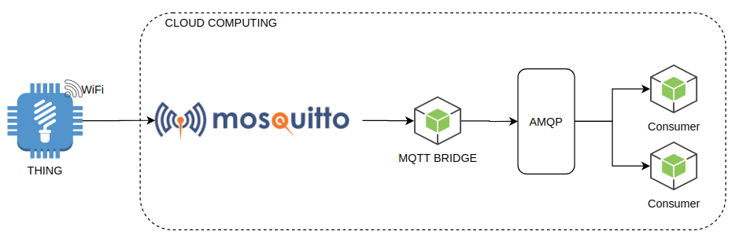

<div style="text-align:center">
  
</div>

# IoT With GoLang

- [Article](https://ralvescosta.medium.com/simple-iot-messages-delivery-with-golang-1-b1ea64d7d3ae)

## Description

In short, Internet of Things is interconnectivity between objects. To make this concept possible, have many technology behinds. Before presenting the adopted approach we need to know some IoT enabling technologies, one of them is MQTT. 

Wait, what is MQTT? MQTT (MQ Telemetry Transport), is a lightweight messaging protocol for sensors and small mobile devices optimized for TCP / IP networks, if you want to improve on the subject read [more](https://developer.ibm.com/articles/iot-mqtt-why-good-for-iot/).

Perfect, now e knew the MQTT and we know this a very fast protocol to transport data, but only MQTT is enough to build a IoT System? Some time when we received the IoT data we need to do a lot of things: Process this data, save in a database, routing this message to a other systems. If we put all of this process connect only in MQTT Broker probably we will have a scale problem in MQTT Broker. Thinking about that the Confluent brings us a new concept, it consists to create a "mqtt bridge" to retrieve data into MQTT Broker and put this data into a Messaging System like Apache Kafka or RabbitMQ and after these datas are into the Queue we can do anything we want in anytime without to worry about scalability problem. This project implements a simple application that handle it. 

## Project Structure

<div align="center">
  
</div>

## Get Started

- Requirements
  - GoLang 1.16.X
  - Docker
  - Docker Compose

- Configure the .env file in the root path

- Create a instance of MQTT Broker and RabbitMQ Broker

  ```bash
  docker-compose up
  ```

- Get Applications Packages

  ```
  go get -u
  ```

- Running application

  - Run all process
    ```bash
    make start
    ```

  - Run one process per time
    ```bash
    make fake_iot_device
    ```

    ```bash
    make mqtt_bridge
    ```

    ```bash
    make data_consumer
    ```
