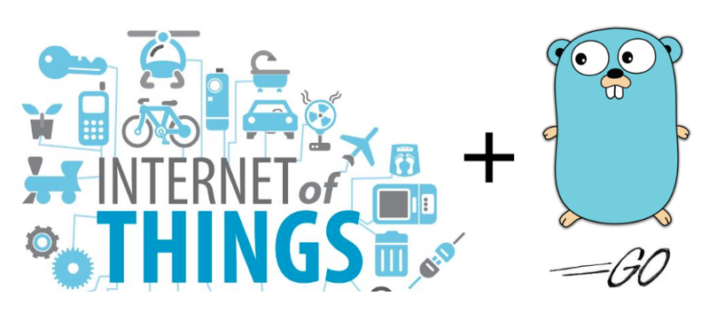

<div style="text-align:center">
  
</div>

# IoT With GoLang


## Get Started

- Requirements
  - GoLang 1.16.X
  - Docker
  - Docker Compose

- Create a instance of MQTT Broker and RabbitMQ Broker

  ```bash
  docker-compose up
  ```

- Get Applications Packages

  ```
  go get -u
  ```

- Running application

  - Run all process
    ```bash
    make start
    ```

  - Ron one process per time
    ```bash
    make mqtt_pub
    ```

    ```bash
    make mqtt_sub
    ```

    ```bash
    make rabbitmq_consumer
    ```